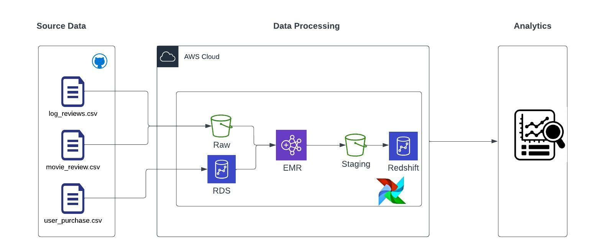

# Data-Bootcamp-Project
This project is an example of how to develop a pipeline to extract-transform and load data. It takes data from external source, and it is processed for exploratory analysis about users’ behavior. This project is prepared to run in AWS cloud provider and have an approach of infrastructure as code (IaC) using Terraform as tool. Also, it uses Apache Airflow as an orchestration tool to control de flow of processes.
## Architecture

## Requirements
-Helm
-Kubectl
-AWS account
-AWS CLI
## How to install and run this pipeline
1.	First you need to download the data csv that you will find in raw_data foler. Keep in mind that you will need the path further, so remember to where the files are.
2.	Then, to keep everything connected to your AWS account, you will need to add your credentials trough AWS CLI, this way, once you use terraform to raise your infrastructure, it will know were to do it. Learn how to get your credentials from AWS,[here](https://docs.aws.amazon.com/cli/latest/userguide/getting-started-prereqs.html#getting-started-prereqs-keys) Learn how configure AWS CLI [here](https://docs.aws.amazon.com/cli/latest/userguide/cli-configure-files.html)
