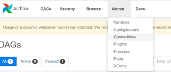
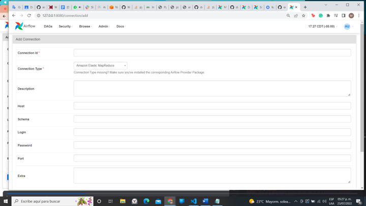
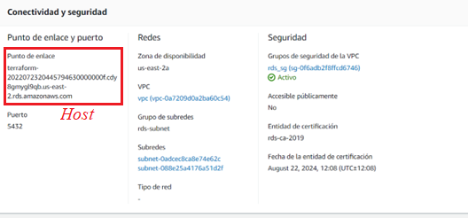
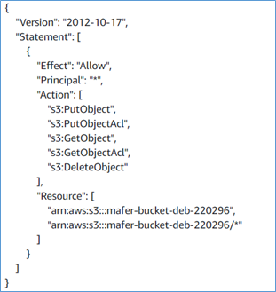

# Data-Bootcamp-Project
This project is an example of how to develop a pipeline to extract-transform and load data. It takes data from external source, and it is processed for exploratory analysis about users’ behavior. This project is prepared to run in AWS cloud provider and have an approach of infrastructure as code (IaC) using Terraform as tool. Also, it uses Apache Airflow as an orchestration tool to control de flow of processes.
## Architecture

## Requirements
- Helm
- Kubectl
- AWS account
- AWS CLI
## How to install and run this pipeline
1.	First you need to download the data csv that you will find in raw_data foler. Keep in mind that you will need the path further, so remember to where the files are.
2.	Then, to keep everything connected to your AWS account, you will need to add your credentials trough AWS CLI, this way, once you use terraform to raise your infrastructure, it will know were to do it. Learn how to get your credentials from AWS [here](https://docs.aws.amazon.com/cli/latest/userguide/getting-started-prereqs.html#getting-started-prereqs-keys). Learn how configure AWS CLI [here](https://docs.aws.amazon.com/cli/latest/userguide/cli-configure-files.html).
3.	Then clone this repo. Now it’s time to use the terraform folder. Go to terraform/aws/terraform.tfvars and in this script in the “S3 variables” part, you will change the name of the bucket for whatever you want your bucket’s name is.
On terraform/aws/modules/s3/main.tf you will need to change the path. Put your local path where you download the files.
After that, follow the instructions attach in the [README](https://github.com/maferchavez/Data-Bootcamp-Project/blob/main/terraform/aws/README.md) part of terraform/aws to create your Kubernetes cluster and install airflow inside the cluster.
### Problem installing airflow (Windows)
If you have a Windows computer, maybe you will face some issues, if you cannot install airflow as how it is described [here](https://github.com/maferchavez/Data-Bootcamp-Project/blob/main/terraform/kubernetes/README.md). Follow this instructions.
1.	Open your cmd (not PowerShell, not Git-Bash) and run all these commands from the terraform/kubernetes folder.

`kubectl create namespace storage`

`helm repo add nfs-subdir-external-provisioner https://kubernetes-sigs.github.io/nfs-subdir-external-provisioner/`

`helm install nfs-subdir-external-provisioner nfs-subdir-external-provisioner/nfs-subdir-external-provisioner --namespace storage --set nfs.server=“NFS_SERVER_NAME” --set nfs.path=/`

  The “NFS_SERVER_NAME” is the efs that is showed on your terminal when you have finished the previous steps of terraform/aws. It will show 3 variables like this:

  *cluster_name = "airflow-eks-data-bootcamp"*

  *__efs ="fs-03f12ba0379a331bd.efs.us-east-2.amazonaws.com"__*

  *region = "us-east-2"*

2.	Replace the NFS_SERVER_NAME with your efs.

`helm install nfs-subdir-external-provisioner nfs-subdir-external-provisioner/nfs-subdir-external-provisioner --namespace storage --set nfs.server="fs-03f12ba0379a331bd.efs.us-east-2.amazonaws.com" --set nfs.path=/`

3.	If this is not working try:

`	helm repo update`

  and repeat the NFS_SERVER_NAME part.

4.  Everything should work, and you can continue installing airflow at is it mentioned in terraform/Kubernetes/README.
Before you see what is happening with your dags, you need to do some changes on it.
  -On dags/my_modules/GitHubToS3BucketOperator.py in function “execute”, you need to change the bucker_name for your bucket’s name. Do the same on dags/spark_dag.py. Look for BUCKET_NAME and change it.
   -Make some connections on airflow. You will need to add 3 connections.

    Click on “+” icon
  -Then in the following window you’ll fill in the blanks.

###Postgres Connection:
•	Connection ID: example
•	Connectrion Type: Postgres
•	Host: look for your host on AWS RDS console 
•	Schema: dbname
•	Login: dbuser
•	Password: dbpassword.
Schema, Login and Password can be found in terraform.tfvars file.
AWS connection:
•	Connection ID: aws_default
•	Connection type: Amazon web Services
•	Extras: {"region_name":"us-east-2"} (or your region)
EMR connection:
•	Connection ID: emr_default
•	Connection Type: Amazon Elastic MapReduce
  -Make your bucket public.
On AWS console go to S3 and select the bucket you create with terraform. Go to “permissions” and copy the json below with your bucket name.
•	Schema: dbname

  
    
